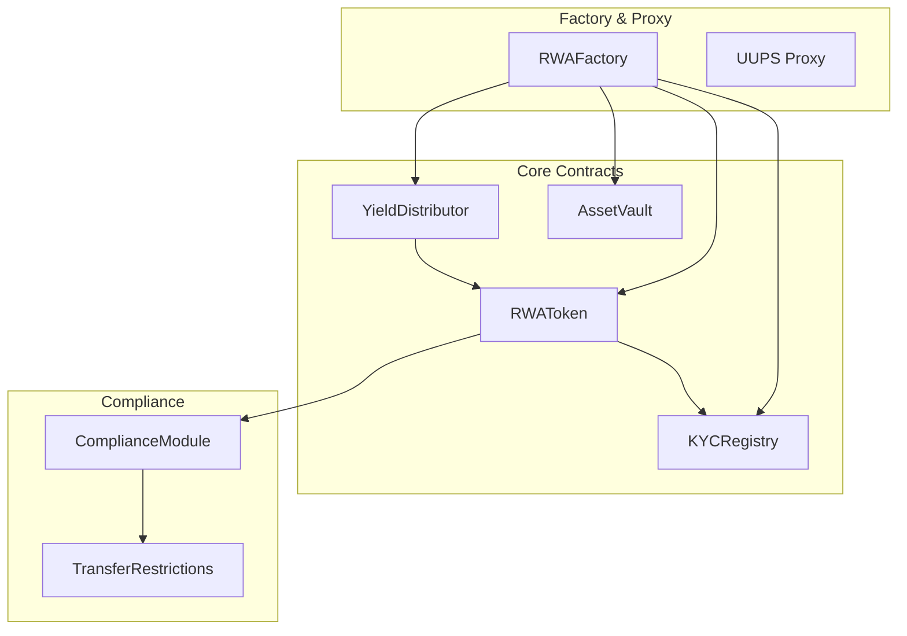

# Smart Contracts

The Mantle RWA SDK includes a suite of audited smart contracts for tokenizing real-world assets with built-in compliance.

## Architecture



## Contract Overview

| Contract | Description | Standard |
|----------|-------------|----------|
| [RWAToken](/docs/api/contracts/rwa-token) | ERC-3643 compliant security token | ERC-20, ERC-3643 |
| [KYCRegistry](/docs/api/contracts/kyc-registry) | On-chain KYC verification | Custom |
| [YieldDistributor](/docs/api/contracts/yield-distributor) | Dividend distribution | Custom |
| [AssetVault](/docs/api/contracts/asset-vault) | Asset custody | Custom |
| [RWAFactory](/docs/api/contracts/rwa-factory) | System deployment factory | Custom |

## Deployment Addresses

### Mantle Sepolia (Testnet)

| Contract | Address |
|----------|---------|
| RWAFactory | `0x...` |
| Implementation (Token) | `0x...` |
| Implementation (KYC) | `0x...` |

### Mantle Mainnet

| Contract | Address |
|----------|---------|
| RWAFactory | `0x...` |
| Implementation (Token) | `0x...` |
| Implementation (KYC) | `0x...` |

## ERC-3643 Compliance

The RWAToken contract implements the ERC-3643 (T-REX) standard for security tokens:

- **Identity Registry**: On-chain KYC verification
- **Compliance Module**: Transfer restrictions
- **Token Lifecycle**: Mint, burn, freeze, pause
- **Recovery**: Lost wallet recovery mechanism

## Upgradeability

All contracts use the UUPS (Universal Upgradeable Proxy Standard) pattern:

```solidity
// Upgrade to new implementation
function upgradeTo(address newImplementation) external onlyAdmin;

// Upgrade with initialization
function upgradeToAndCall(
    address newImplementation,
    bytes memory data
) external onlyAdmin;
```

## Access Control

Contracts use role-based access control:

| Role | Description |
|------|-------------|
| `DEFAULT_ADMIN_ROLE` | Full administrative access |
| `MINTER_ROLE` | Can mint new tokens |
| `BURNER_ROLE` | Can burn tokens |
| `PAUSER_ROLE` | Can pause/unpause |
| `COMPLIANCE_ROLE` | Can update compliance rules |
| `VERIFIER_ROLE` | Can verify investors |

## Gas Optimization

Contracts are optimized for Mantle Network:

- Batch operations for reduced gas
- Efficient storage patterns
- Minimal external calls
- Optimized loops

## Security

- Audited by [Auditor Name]
- Bug bounty program active
- Formal verification for critical functions
- Comprehensive test coverage

## Installation

```bash npm2yarn
npm install @mantle-rwa/contracts
```

## Usage

### Import in Solidity

```solidity
import "@mantle-rwa/contracts/RWAToken.sol";
import "@mantle-rwa/contracts/KYCRegistry.sol";
```

### Import ABIs

```typescript
import { RWATokenABI, KYCRegistryABI } from '@mantle-rwa/contracts';
```

## Next Steps

- [RWAToken Contract](/docs/api/contracts/rwa-token)
- [KYCRegistry Contract](/docs/api/contracts/kyc-registry)
- [Deployment Guide](/docs/guides/deployment)
