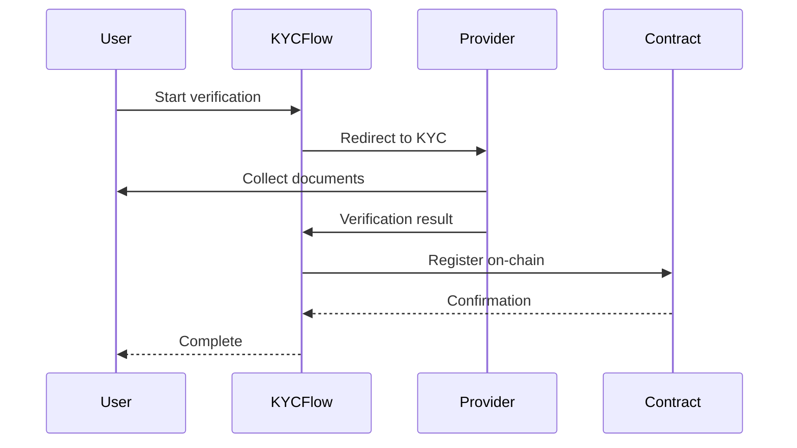

# KYCFlow

The `KYCFlow` component provides a complete KYC verification flow with support for multiple providers.

## Import

```tsx
import { KYCFlow } from '@mantle-rwa/react';
```

## Basic Usage

```tsx
<KYCFlow
  kycRegistryAddress="0x..."
  onComplete={(result) => {
    console.log('Verification complete:', result);
  }}
/>
```

## Props

| Prop | Type | Required | Description |
|------|------|----------|-------------|
| `kycRegistryAddress` | `string` | Yes | Address of the KYC registry contract |
| `onComplete` | `(result: KYCResult) => void` | No | Callback when verification completes |
| `onError` | `(error: Error) => void` | No | Callback when an error occurs |
| `provider` | `'persona' \| 'synaps' \| 'jumio'` | No | KYC provider to use |
| `requiredLevel` | `AccreditationLevel` | No | Required accreditation level |
| `showProgress` | `boolean` | No | Show progress indicator |
| `className` | `string` | No | Additional CSS class |
| `style` | `CSSProperties` | No | Inline styles |

## Examples

### With Provider Selection

```tsx
<KYCFlow
  kycRegistryAddress="0x..."
  provider="persona"
  onComplete={(result) => {
    if (result.verified) {
      router.push('/dashboard');
    }
  }}
  onError={(error) => {
    toast.error(error.message);
  }}
/>
```

### With Required Accreditation

```tsx
<KYCFlow
  kycRegistryAddress="0x..."
  requiredLevel="accredited"
  onComplete={(result) => {
    console.log('Accreditation level:', result.accreditationLevel);
  }}
/>
```

### Custom Styling

```tsx
<KYCFlow
  kycRegistryAddress="0x..."
  className="my-kyc-flow"
  style={{ maxWidth: '500px', margin: '0 auto' }}
/>
```

## KYCResult Type

```typescript
interface KYCResult {
  verified: boolean;
  address: string;
  accreditationLevel: AccreditationLevel;
  country: string;
  verificationId: string;
  expirationDate: number;
}
```

## Verification Flow

The component handles the complete verification flow:

1. **Connect Wallet** - User connects their wallet
2. **Check Status** - Check if already verified
3. **Start Verification** - Redirect to KYC provider
4. **Complete Verification** - Handle callback from provider
5. **On-chain Registration** - Register verification on-chain



## Provider Configuration

### Persona

```tsx
<KYCFlow
  kycRegistryAddress="0x..."
  provider="persona"
  providerConfig={{
    templateId: 'tmpl_...',
    environment: 'sandbox', // or 'production'
  }}
/>
```

### Synaps

```tsx
<KYCFlow
  kycRegistryAddress="0x..."
  provider="synaps"
  providerConfig={{
    sessionId: 'session_...',
    tier: 'standard',
  }}
/>
```

## Customization

### Custom Steps

```tsx
<KYCFlow
  kycRegistryAddress="0x..."
  steps={[
    { id: 'connect', label: 'Connect Wallet' },
    { id: 'identity', label: 'Verify Identity' },
    { id: 'accreditation', label: 'Accreditation' },
    { id: 'complete', label: 'Complete' },
  ]}
/>
```

### Custom Render

```tsx
<KYCFlow
  kycRegistryAddress="0x..."
  renderStep={(step, props) => (
    <CustomStep step={step} {...props} />
  )}
/>
```

## Events

```tsx
<KYCFlow
  kycRegistryAddress="0x..."
  onStepChange={(step) => {
    analytics.track('kyc_step', { step });
  }}
  onComplete={(result) => {
    analytics.track('kyc_complete', result);
  }}
  onError={(error) => {
    analytics.track('kyc_error', { error: error.message });
  }}
/>
```

## Styling

### CSS Variables

```css
.rwa-kyc-flow {
  --kyc-primary-color: #65B3AE;
  --kyc-background: #1A1A1A;
  --kyc-border-radius: 8px;
  --kyc-font-family: 'Inter', sans-serif;
}
```

### Class Names

| Class | Description |
|-------|-------------|
| `.rwa-kyc-flow` | Root container |
| `.rwa-kyc-step` | Step container |
| `.rwa-kyc-step--active` | Active step |
| `.rwa-kyc-step--complete` | Completed step |
| `.rwa-kyc-progress` | Progress indicator |
| `.rwa-kyc-button` | Action buttons |

## See Also

- [KYCModule](/docs/api/sdk/kyc-module)
- [KYC Integration Guide](/docs/guides/kyc-integration)
