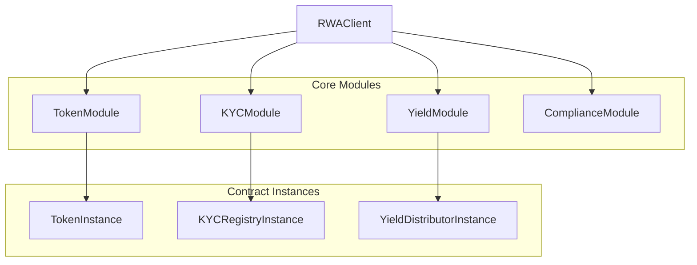

# SDK API Reference

The Mantle RWA SDK provides a comprehensive TypeScript library for interacting with RWA tokenization contracts. It offers a high-level, developer-friendly interface that abstracts away the complexity of direct smart contract interactions.

## Installation

```bash
npm install @mantle-rwa/sdk ethers@^6.0.0
```

## Quick Start

```typescript
import { RWAClient } from '@mantle-rwa/sdk';

// Initialize client
const client = new RWAClient({
  network: 'mantle-sepolia',
  privateKey: process.env.PRIVATE_KEY,
});

// Deploy a complete RWA system
const contracts = await client.deployRWASystem({
  tokenName: 'Miami Luxury Condo',
  tokenSymbol: 'MLC',
  initialSupply: '1000',
  vaultSigners: ['0x...', '0x...'],
  vaultThreshold: 2,
});

console.log('Token deployed at:', contracts.token);
```

## Architecture

The SDK is organized into modules that correspond to different aspects of RWA tokenization:



## Core Concepts

### Client-Module Pattern

The SDK uses a client-module pattern where:
- **RWAClient** is the main entry point
- **Modules** provide functionality for specific contract types
- **Instances** represent connections to deployed contracts

```typescript
// Client provides access to modules
const client = new RWAClient(config);

// Modules provide deployment and connection capabilities
const tokenInstance = client.token.connect('0x...');

// Instances provide contract-specific operations
const balance = await tokenInstance.balanceOf('0x...');
```

### Network Configuration

The SDK supports multiple network configurations:

```typescript
// Predefined networks
const client = new RWAClient({
  network: 'mantle-sepolia', // or 'mantle'
  privateKey: '0x...',
});

// Custom network
const client = new RWAClient({
  network: {
    chainId: 5003,
    rpcUrl: 'https://rpc.sepolia.mantle.xyz',
    name: 'Mantle Sepolia',
  },
  privateKey: '0x...',
});
```

### Error Handling

The SDK provides structured error handling with specific error types:

```typescript
import { RWAError, ContractError, NetworkError } from '@mantle-rwa/sdk';

try {
  await token.mint(recipient, amount);
} catch (error) {
  if (error instanceof ContractError) {
    console.log('Contract error:', error.revertReason);
  } else if (error instanceof NetworkError) {
    console.log('Network error:', error.message);
  } else if (error instanceof RWAError) {
    console.log('RWA error:', error.suggestion);
  }
}
```

### Transaction Options

All write operations support transaction options:

```typescript
const options = {
  gasLimit: 500000n,
  maxFeePerGas: 20000000000n, // 20 gwei
  retries: 3,
  retryDelay: 1000, // 1 second
};

await token.mint(recipient, amount, options);
```

## Modules

### [RWAClient](./rwa-client)
Main entry point providing access to all modules and factory deployment.

**Key Features:**
- Network configuration
- Factory deployment
- Module access
- Connection management

### [TokenModule](./token-module)
Handles RWA token deployment and interactions.

**Key Features:**
- Token deployment
- Mint/burn operations
- Transfer management
- Compliance integration
- Snapshot functionality

### [KYCModule](./kyc-module)
Manages investor verification and KYC registry operations.

**Key Features:**
- Provider integrations (Persona, Synaps, Jumio)
- Registry management
- Batch operations
- Identity hash generation

### [YieldModule](./yield-module)
Handles yield distribution and claiming operations.

**Key Features:**
- Distribution creation
- Proportional calculations
- Claim management
- Distribution previews

### [ComplianceModule](./compliance-module)
Provides transfer eligibility checking and compliance reporting.

**Key Features:**
- Transfer eligibility checks
- Compliance reporting
- Regulatory filing preparation
- Export capabilities

## Type Definitions

### Core Types

```typescript
// Network configuration
interface NetworkConfig {
  name: string;
  chainId: number;
  rpcUrl: string;
  explorerUrl: string;
  contracts?: {
    factory?: string;
  };
}

// Transaction result
interface TransactionResult {
  hash: string;
  blockNumber: number;
  gasUsed: bigint;
  status: 'success' | 'failed';
  events: ParsedEvent[];
}

// Accreditation tiers
enum AccreditationTier {
  None = 0,
  Retail = 1,
  Accredited = 2,
  Institutional = 3
}
```

### Deployment Types

```typescript
interface DeploymentConfig {
  tokenName: string;
  tokenSymbol: string;
  initialSupply: string;
  complianceModules?: string[];
  yieldClaimWindowDays?: number;
  vaultSigners: string[];
  vaultThreshold: number;
  vaultWithdrawalThreshold?: string;
}

interface DeployedContracts {
  token: string;
  vault: string;
  yieldDistributor: string;
  kycRegistry: string;
}
```

## Common Patterns

### Deployment Flow

```typescript
// 1. Deploy complete system
const contracts = await client.deployRWASystem({
  tokenName: 'Real Estate Fund',
  tokenSymbol: 'REF',
  initialSupply: '1000000',
  vaultSigners: signers,
  vaultThreshold: 2,
});

// 2. Connect to deployed contracts
const token = client.token.connect(contracts.token);
const kycRegistry = client.kyc.connect(contracts.kycRegistry);
const yieldDistributor = client.yield.connect(contracts.yieldDistributor);
```

### Investor Onboarding

```typescript
// 1. Add investor to KYC registry
await kycRegistry.addInvestor(
  investorAddress,
  AccreditationTier.Accredited,
  new Date(Date.now() + 365 * 24 * 60 * 60 * 1000), // 1 year
  identityHash
);

// 2. Mint tokens to verified investor
await token.mint(investorAddress, '100');

// 3. Verify transfer eligibility
const eligibility = await client.compliance.checkTransferEligibility(
  contracts.token,
  issuerAddress,
  investorAddress,
  '50'
);

if (eligibility.eligible) {
  await token.transfer(investorAddress, '50');
}
```

### Yield Distribution

```typescript
// 1. Preview distribution
const preview = await client.yield.previewDistribution(
  contracts.token,
  '10000', // $10k yield
  undefined, // current snapshot
  holderAddresses
);

console.log('Distribution preview:', preview);

// 2. Create distribution
const { distributionId } = await yieldDistributor.createDistribution(
  usdcAddress,
  '10000',
  30 // 30-day claim window
);

// 3. Investors claim yield
await yieldDistributor.claim(distributionId);
```

### Event Listening

```typescript
// Listen for token transfers
const unsubscribe = token.onTransfer((from, to, amount) => {
  console.log(`Transfer: ${from} → ${to}, Amount: ${amount}`);
});

// Listen for restricted transfers
token.onTransferRestricted((from, to, amount, reason) => {
  console.log(`Transfer blocked: ${reason}`);
});

// Clean up listeners
unsubscribe();
```

## Utilities

The SDK provides utility functions for common operations:

```typescript
import {
  isValidAddress,
  normalizeAddress,
  parseAmount,
  formatAmount,
  hashIdentityData,
  timestampToDate,
  dateToTimestamp,
} from '@mantle-rwa/sdk';

// Address validation
if (isValidAddress(address)) {
  const normalized = normalizeAddress(address);
}

// Amount parsing
const amountWei = parseAmount('100.5'); // Returns bigint
const formatted = formatAmount(amountWei, 18); // Returns string

// Identity hashing
const hash = hashIdentityData({
  firstName: 'John',
  lastName: 'Doe',
  dateOfBirth: '1990-01-01',
});

// Date conversion
const timestamp = dateToTimestamp(new Date());
const date = timestampToDate(timestamp);
```

## Configuration

### Default Values

```typescript
const DEFAULTS = {
  TRANSACTION_RETRIES: 3,
  RETRY_DELAY_MS: 1000,
  YIELD_CLAIM_WINDOW_DAYS: 30,
  VAULT_WITHDRAWAL_THRESHOLD: '100000', // $100k
  GAS_BUFFER_PERCENTAGE: 20, // 20% buffer for gas estimation
};
```

### Network Endpoints

| Network | Chain ID | RPC URL | Explorer |
|---------|----------|---------|----------|
| Mantle Sepolia | 5003 | `https://rpc.sepolia.mantle.xyz` | `https://explorer.sepolia.mantle.xyz` |
| Mantle Mainnet | 5000 | `https://rpc.mantle.xyz` | `https://explorer.mantle.xyz` |

## Best Practices

### Error Handling

```typescript
// Always handle specific error types
try {
  await token.mint(recipient, amount);
} catch (error) {
  if (error instanceof ContractError) {
    // Handle contract-specific errors
    if (error.revertReason?.includes('NotVerified')) {
      console.log('Recipient needs KYC verification');
    }
  } else if (error instanceof NetworkError && error.retryable) {
    // Retry network errors
    await new Promise(resolve => setTimeout(resolve, 1000));
    return token.mint(recipient, amount);
  }
  throw error;
}
```

### Gas Optimization

```typescript
// Use batch operations when possible
await kycRegistry.batchAddInvestors([
  { address: '0x...', tier: AccreditationTier.Accredited, ... },
  { address: '0x...', tier: AccreditationTier.Retail, ... },
]);

// Set appropriate gas limits for complex operations
await token.mint(recipient, amount, {
  gasLimit: 200000n, // Set based on operation complexity
});
```

### Event Monitoring

```typescript
// Set up comprehensive event monitoring
const setupEventListeners = (token, kycRegistry, yieldDistributor) => {
  // Token events
  token.onTransfer((from, to, amount) => {
    logEvent('Transfer', { from, to, amount });
  });
  
  token.onTransferRestricted((from, to, amount, reason) => {
    logEvent('TransferRestricted', { from, to, amount, reason });
  });
  
  // KYC events
  kycRegistry.onInvestorVerified((investor, tier, expiry) => {
    logEvent('InvestorVerified', { investor, tier, expiry });
  });
  
  // Yield events
  yieldDistributor.onDistributionCreated((id, token, amount, snapshot) => {
    logEvent('DistributionCreated', { id, token, amount, snapshot });
  });
};
```

## Testing

### Unit Testing

```typescript
import { RWAClient } from '@mantle-rwa/sdk';
import { ethers } from 'ethers';

describe('RWA SDK', () => {
  let client: RWAClient;
  
  beforeEach(() => {
    // Use local test network
    client = new RWAClient({
      network: {
        chainId: 31337,
        rpcUrl: 'http://localhost:8545',
      },
      privateKey: '0x...',
    });
  });
  
  it('should deploy RWA system', async () => {
    const contracts = await client.deployRWASystem({
      tokenName: 'Test Token',
      tokenSymbol: 'TEST',
      initialSupply: '1000',
      vaultSigners: [await client.signer.getAddress()],
      vaultThreshold: 1,
    });
    
    expect(contracts.token).toMatch(/^0x[a-fA-F0-9]{40}$/);
  });
});
```

### Integration Testing

```typescript
// Test complete investor flow
it('should handle complete investor onboarding', async () => {
  // Deploy system
  const contracts = await client.deployRWASystem(config);
  
  // Connect to contracts
  const token = client.token.connect(contracts.token);
  const kycRegistry = client.kyc.connect(contracts.kycRegistry);
  
  // Add investor to KYC
  await kycRegistry.addInvestor(
    investor,
    AccreditationTier.Accredited,
    new Date(Date.now() + 365 * 24 * 60 * 60 * 1000),
    '0x...'
  );
  
  // Mint tokens
  await token.mint(investor, '100');
  
  // Verify balance
  const balance = await token.balanceOf(investor);
  expect(balance).toBe(100n * 10n ** 18n);
});
```

## Migration Guide

### From v0.1.x to v0.2.x

```typescript
// Old API (v0.1.x)
const client = new RWAClient('mantle-sepolia', privateKey);
await client.deployToken(config);

// New API (v0.2.x)
const client = new RWAClient({
  network: 'mantle-sepolia',
  privateKey,
});
await client.deployRWASystem(config);
```

## Support

- [GitHub Issues](https://github.com/AqilaRifti/MantleRWADevkit/issues)
- [GitHub Discussions](https://github.com/AqilaRifti/MantleRWADevkit/discussions)
- [Documentation](https://mantle-rwa-devkit-docs.vercel.app/)
- [Examples Repository](https://github.com/AqilaRifti/MantleRWADevkit/tree/main/examples)