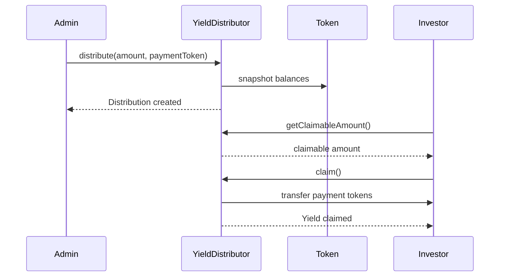

# YieldModule

The `YieldModule` provides methods for distributing yield and managing dividend payments to token holders.

## Getting an Instance

```typescript
import { RWAClient } from '@mantle-rwa/sdk';

const client = new RWAClient({ network: 'mantle-sepolia', privateKey: '...' });

// From deployment
const deployment = await client.deployRWASystem({ ... });
const yieldModule = deployment.yieldDistributor;

// From existing address
const yieldModule = client.yield('0x1234...');
```

## Properties

### `address`

The contract address of the yield distributor.

```typescript
const address: string = yieldModule.address;
```

## Read Methods

### `getDistributionInfo`

Returns information about a specific distribution.

```typescript
const info = await yieldModule.getDistributionInfo(distributionId: number): Promise<DistributionInfo>;
```

#### Returns

```typescript
interface DistributionInfo {
  id: number;
  totalAmount: bigint;
  paymentToken: string;
  snapshotBlock: number;
  distributionDate: number;
  totalClaimed: bigint;
  status: 'pending' | 'active' | 'completed';
}
```

### `getClaimableAmount`

Returns the claimable yield amount for an address.

```typescript
const amount = await yieldModule.getClaimableAmount(
  address: string,
  distributionId?: number
): Promise<bigint>;
```

#### Example

```typescript
// Get claimable from all distributions
const total = await yieldModule.getClaimableAmount('0x1234...');

// Get claimable from specific distribution
const specific = await yieldModule.getClaimableAmount('0x1234...', 5);
```

### `hasClaimed`

Checks if an address has claimed from a distribution.

```typescript
const claimed = await yieldModule.hasClaimed(
  address: string,
  distributionId: number
): Promise<boolean>;
```

### `getTotalDistributed`

Returns the total amount distributed across all distributions.

```typescript
const total = await yieldModule.getTotalDistributed(): Promise<bigint>;
```

### `getDistributionCount`

Returns the total number of distributions.

```typescript
const count = await yieldModule.getDistributionCount(): Promise<number>;
```

### `previewDistribution`

Previews a distribution without executing it.

```typescript
const preview = await yieldModule.previewDistribution(amount: string): Promise<DistributionPreview>;
```

#### Returns

```typescript
interface DistributionPreview {
  totalAmount: bigint;
  eligibleHolders: number;
  perTokenAmount: bigint;
  estimatedGas: bigint;
  breakdown: {
    address: string;
    balance: bigint;
    share: bigint;
  }[];
}
```

#### Example

```typescript
const preview = await yieldModule.previewDistribution('100000');
console.log('Eligible holders:', preview.eligibleHolders);
console.log('Per token:', preview.perTokenAmount);
```

## Write Methods

### `distribute`

Creates a new yield distribution.

```typescript
const tx = await yieldModule.distribute(params: DistributeParams, options?: TxOptions): Promise<TransactionReceipt>;
```

#### Parameters

| Parameter | Type | Required | Description |
|-----------|------|----------|-------------|
| `amount` | `string` | Yes | Total amount to distribute |
| `paymentToken` | `string` | Yes | Address of payment token (e.g., USDC) |
| `snapshotBlock` | `number` | No | Block number for balance snapshot |
| `memo` | `string` | No | Distribution memo/description |

#### Example

```typescript
const tx = await yieldModule.distribute({
  amount: '100000', // 100,000 USDC
  paymentToken: '0xUSDC...',
  memo: 'Q4 2024 Dividend',
});

console.log('Distribution ID:', tx.events.DistributionCreated.distributionId);
```

#### Errors

| Error | Condition |
|-------|-----------|
| `UnauthorizedError` | Caller doesn't have distributor role |
| `InsufficientBalanceError` | Not enough payment tokens |
| `NoEligibleHoldersError` | No token holders eligible for distribution |

### `claim`

Claims yield for the caller.

```typescript
const tx = await yieldModule.claim(distributionId?: number, options?: TxOptions): Promise<TransactionReceipt>;
```

#### Example

```typescript
// Claim from all distributions
await yieldModule.claim();

// Claim from specific distribution
await yieldModule.claim(5);
```

### `claimFor`

Claims yield on behalf of another address.

```typescript
const tx = await yieldModule.claimFor(
  address: string,
  distributionId?: number,
  options?: TxOptions
): Promise<TransactionReceipt>;
```

### `batchClaim`

Claims from multiple distributions in a single transaction.

```typescript
const tx = await yieldModule.batchClaim(
  distributionIds: number[],
  options?: TxOptions
): Promise<TransactionReceipt>;
```

#### Example

```typescript
await yieldModule.batchClaim([1, 2, 3, 4, 5]);
```

### `setPaymentToken`

Sets the default payment token for distributions.

```typescript
const tx = await yieldModule.setPaymentToken(
  tokenAddress: string,
  options?: TxOptions
): Promise<TransactionReceipt>;
```

### `withdrawUnclaimed`

Withdraws unclaimed yield after expiration period.

```typescript
const tx = await yieldModule.withdrawUnclaimed(
  distributionId: number,
  options?: TxOptions
): Promise<TransactionReceipt>;
```

## Configuration

### `setDistributionConfig`

Configures distribution parameters.

```typescript
const tx = await yieldModule.setDistributionConfig(config: DistributionConfig, options?: TxOptions): Promise<TransactionReceipt>;
```

#### Parameters

```typescript
interface DistributionConfig {
  minDistributionAmount?: string;
  claimExpirationPeriod?: number; // seconds
  autoDistribute?: boolean;
  distributionFrequency?: 'daily' | 'weekly' | 'monthly' | 'quarterly';
}
```

#### Example

```typescript
await yieldModule.setDistributionConfig({
  minDistributionAmount: '1000',
  claimExpirationPeriod: 90 * 24 * 60 * 60, // 90 days
  distributionFrequency: 'quarterly',
});
```

## Events

### Subscribing to Events

```typescript
// Distribution created
yieldModule.on('DistributionCreated', (id, amount, paymentToken) => {
  console.log(`Distribution ${id}: ${amount} ${paymentToken}`);
});

// Yield claimed
yieldModule.on('YieldClaimed', (address, distributionId, amount) => {
  console.log(`${address} claimed ${amount} from distribution ${distributionId}`);
});

// Distribution completed
yieldModule.on('DistributionCompleted', (id, totalClaimed, unclaimed) => {
  console.log(`Distribution ${id} completed: ${totalClaimed} claimed, ${unclaimed} unclaimed`);
});
```

## Distribution Flow



## See Also

- [RWAClient](/docs/api/sdk/rwa-client)
- [TokenModule](/docs/api/sdk/token-module)
- [Yield Distribution Guide](/docs/guides/yield-distribution)
