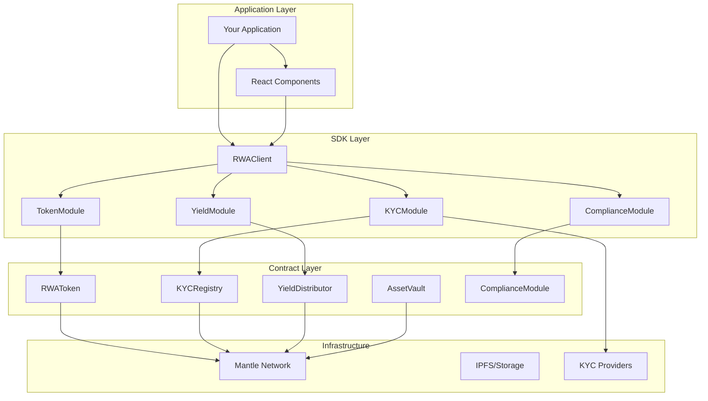
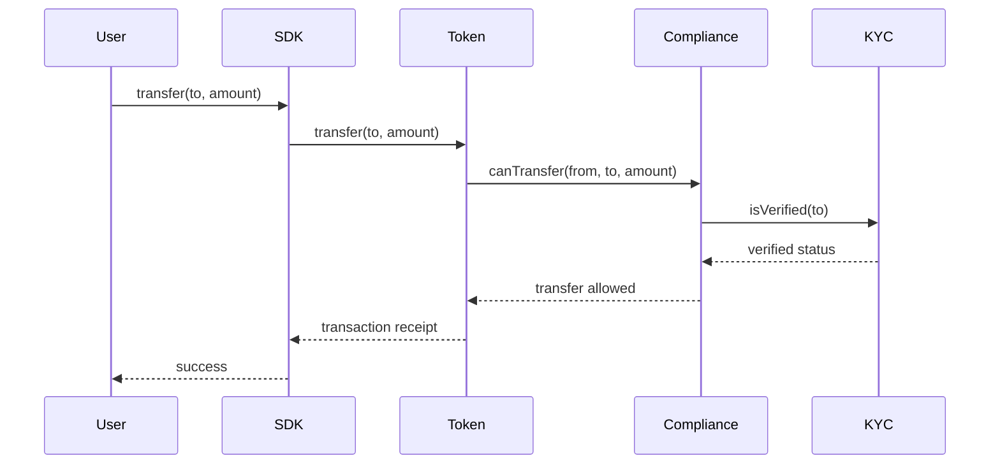
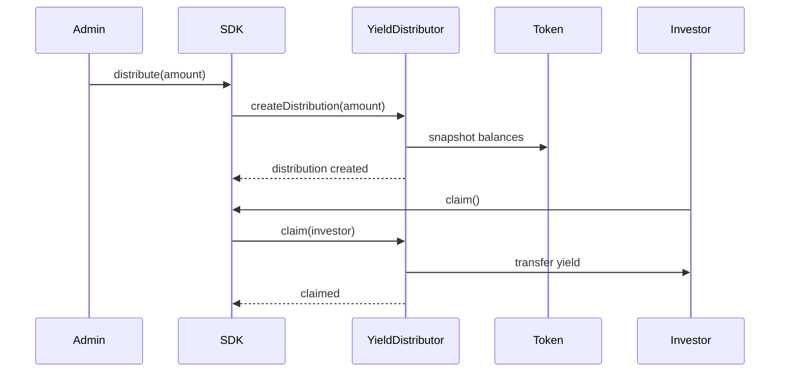
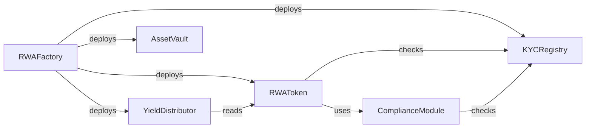

# Architecture Overview

This document provides a comprehensive overview of the Mantle RWA SDK architecture.

## System Architecture



## Token Transfer Flow



## Yield Distribution Flow



## Contract Relationships



## Component Overview

### Smart Contracts

| Contract | Purpose |
|----------|---------|
| RWAToken | ERC-3643 security token |
| KYCRegistry | Investor verification |
| YieldDistributor | Dividend distribution |
| AssetVault | Asset custody |
| ComplianceModule | Transfer restrictions |
| RWAFactory | System deployment |

### SDK Modules

| Module | Purpose |
|--------|---------|
| RWAClient | Main entry point |
| TokenModule | Token operations |
| KYCModule | KYC management |
| YieldModule | Yield distribution |
| ComplianceModule | Compliance rules |

### React Components

| Component | Purpose |
|-----------|---------|
| KYCFlow | Verification flow |
| InvestorDashboard | Portfolio view |
| TokenMintForm | Minting interface |
| YieldCalculator | Yield projections |

## Security Model

### Access Control

```
DEFAULT_ADMIN_ROLE
├── MINTER_ROLE
├── BURNER_ROLE
├── PAUSER_ROLE
├── COMPLIANCE_ROLE
└── VERIFIER_ROLE
```

### Upgradeability

All contracts use UUPS proxy pattern:
- Implementation contracts are upgradeable
- Only admin can upgrade
- Storage layout preserved across upgrades

## See Also

- [API Overview](/docs/api/overview)
- [Smart Contracts](/docs/api/contracts/overview)
- [Security Best Practices](/docs/guides/security-best-practices)
